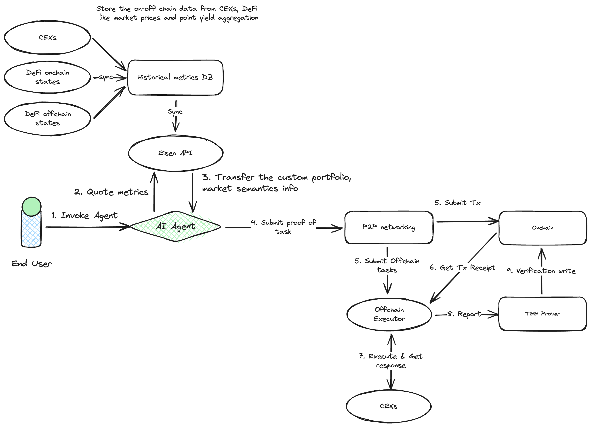

# Chill PM (Chill Paper Maker)

Welcome to **Chill PM**, an AI-driven agent that helps you create **delta-neutral yield farming strategies** across both centralized (CEX) and decentralized (DEX) exchanges. The goal is to optimize yield by combining real-time on-chain/off-chain data, historical metrics, and AI-driven portfolio recommendations—all while ensuring trust and security through AVS (Attestation/Validating Services) and TEE (Trusted Execution Environment) layers.

---

## Overview

**Delta-neutral** strategies aim to hedge market exposure so that the overall portfolio remains relatively insensitive to price movements. This approach typically involves:

1. **Leveraged positions** to amplify yield,
2. **Hedged positions** (long/short) to offset price risk,
3. **Automated rebalancing** to maintain neutrality.

Chill PM’s AI Agent collects data from both on-chain and off-chain sources, processes it, and suggests optimal leverage ratios, asset pairs, and rebalancing schedules. You can think of it as your personal quant strategist, always on the lookout for the best yield opportunities.

---

## Architecture

Below is a high-level look at the system’s architecture:



### Key Components

1. **End User**  
   The user or application that wants to generate or manage a delta-neutral strategy.

2. **AI Agent**

   - **Core Logic**: Gathers metrics from the Historical Metrics DB and real-time data via Eisen API.
   - **Recommendation Engine**: Proposes leverage ratios, asset pairs, rebalancing schedules, and more.
   - **Portfolio Management**: Translates your risk/return preferences into actionable yield-farming positions.

3. **Historical Metrics DB**

   - Aggregates data from on-chain (DEXs, yield farms, protocols) and off-chain (CEXs, external market data) sources.
   - Used by the AI Agent to build models and backtest strategies.

4. **Eisen API**

   - Connects to the Historical Metrics DB and streams relevant data to the AI Agent.
   - Provides real-time updates for yield rates, liquidity, and price feeds.
   - Provides user portfolio information for each asset exposure from multi-chain.

5. **P2P Networking & Transaction Submission**

   - Bridges the AI Agent’s instructions with the blockchain (Onchain).
   - Submits transactions to be recorded and verified.

6. **Onchain & Offchain Executors**

   - **Onchain**: Smart contracts or on-chain instructions to swap, deposit, borrow, lend, or stake tokens.
   - **Offchain**: Interaction with centralized exchanges to manage hedges, borrow rates, or short positions.

7. **AVS Layer (Othentic on Eigen Layer)**

   - Validating/Attestation service ensuring that the data and tasks performed by the AI Agent are trustworthy and correct.
   - Provides cryptographic proofs that the strategy and actions follow the stated rules and conditions.

8. **TEE (Trusted Execution Environment) Layer**
   - Could be **Altlayer Stack** or **Phala Stacks**.
   - Ensures secure, confidential computation of sensitive operations (e.g., offchain task verification).

---

## How It Works

1. **Invoke AI Agent**

   - You (the user) specify your target yield, risk tolerance, and capital allocation for each exchange and chain.
   - The AI Agent then retrieves historical yield data, liquidity metrics, and price feeds.

2. **Quote & Analysis**

   - The AI Agent processes data to find optimal **delta-neutral** setups.
   - It calculates leverage ratios, recommended asset pairs or protocols, and expected yields.

3. **Proof of Task & Validation**

   - Once you approve the suggested strategy, the AI Agent generates a proof of the intended actions.
   - This proof is sent to the AVS layer (Othentic on Eigen Layer) for validation.

4. **Transaction Submission**

   - After validation, transactions are submitted to the blockchain.
   - Onchain logic handles DeFi protocol interactions (lending, borrowing, staking).

5. **Offchain Execution**

   - For hedging or leveraging on centralized platforms, the Offchain Executor places orders or adjusts positions on your behalf.

6. **TEE Security**

   - The TEE layer (Altlayer or Phala) ensures that sensitive data—like private keys, advanced AI logic—remain confidential and off chain task verification.

7. **Monitoring & Rebalancing**
   - The AI Agent continuously monitors market conditions.
   - If the portfolio drifts from the target delta-neutral state, the AI Agent re-optimizes and repeats the cycle.

---

## Features

- **Delta-Neutral Strategy Generation**  
  Automatically finds the best mix of long/short or buy/sell or lend/borrow positions to offset price exposure.

- **Multi-Platform Integration**

  - **DeFi Protocols**: Access various yield-farming protocols, liquidity pools, and staking options.
  - **CEXs**: Manage leverage, shorting, or advanced order types to refine hedges.

- **Automated Leverage Ratio Calculation**  
  Suggests optimal leverage based on real-time liquidity, borrowing rates, and your risk parameters.

- **Portfolio Rebalancing**  
  Keeps your positions balanced, ensuring your exposure remains hedged as market conditions change.

- **Secure & Trustworthy Execution**
  - **AVS**: Data and actions are validated by Othentic on Eigen Layer.
  - **TEE**: Private computations and key management in a secure enclave (Altlayer or Phala).

---

## Getting Started

1. **Clone the Repo**

   ```bash
   git clone https://github.com/your-org/chill-pm.git
   cd chill-pm
   ```

2. **Install Dependencies**

   ```bash
   rustup toolchain install 1.81
   cargo build
   ```

3. **Configure Environment**

   - **API Keys**: Provide your CEX API credentials for offchain execution (if required).
   - **Blockchain RPC**: Configure your preferred network RPC endpoints.
   - **TEE Setup**: If using Altlayer or Phala, ensure you have the appropriate keys and environment variables.

4. **Run the AI Agent**

   ```bash
   cargo run
   ```

5. **Interact via CLI or UI**
   - Provide your desired risk level, total capital, and any other constraints for each exchange and chain.
   - Let the AI Agent propose a strategy, then approve or modify before execution.

---

## Contributing

Contributions are welcome! Feel free to open issues, create pull requests, or discuss feature ideas. Make sure to follow our [Code of Conduct](CODE_OF_CONDUCT.md) and review guidelines before submitting changes.

---

## License

This project is licensed under the [MIT License](LICENSE). Feel free to use it, modify it, and distribute it as you see fit.

---

## Contact

- **Maintainers**: Conner from [EisenLabs](https://x.com/eisenlabs), Jinsuk
- **Community & Support**: Open a GitHub Issue or join our community channels (Slack, Discord, etc.).

---

**Chill PM** — _Automate your delta-neutral yield farming across CEXs and DEXs with AI-driven insights, secure enclaves, and robust validation layers._
